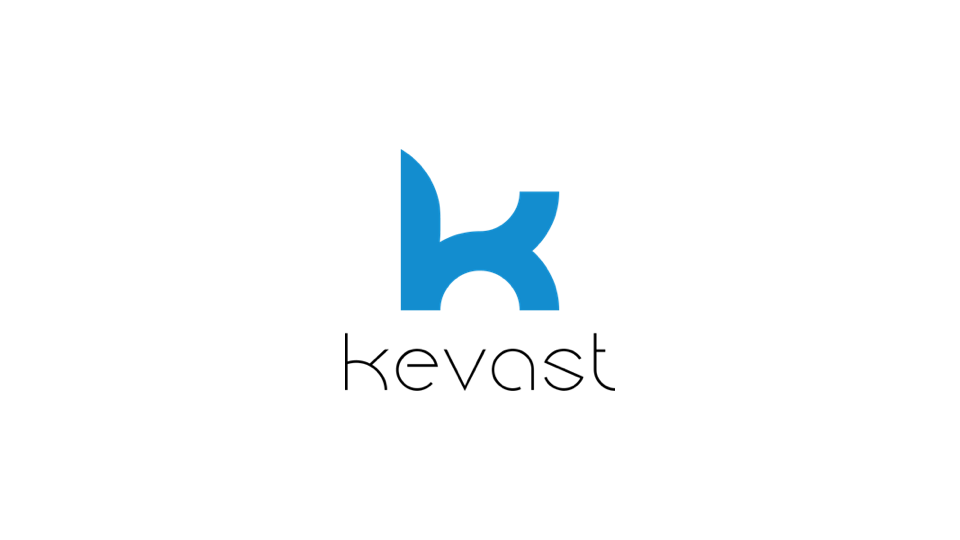
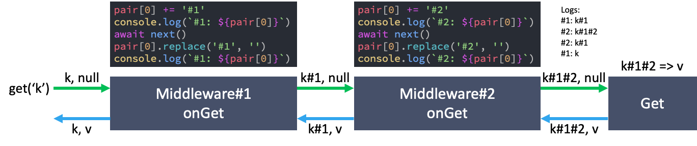
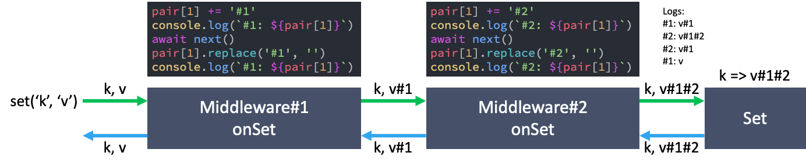

# kevast.js


Kevast is a dependency-free **key-value storage interface**, allowing you to **access key-value based data wherever you want**, memory, file, gist, redis, google drive, etc.
With kevast's **onion-like middleware** stack flows, you can perform actions downstream and upstream.

Kevast.js is Javascript version of kevast for both Node.js and browser.

## Installation
### Node.js
Using yarn
```bash
yarn add kevast
```

Using npm
```bash
npm install kevast
```

### Browser
Latest version
```html
<script src="https://cdn.jsdelivr.net/npm/kevast/dist/browser/kevast.min.js"></script>
```
Specific version
```html
<script src="https://cdn.jsdelivr.net/npm/kevast@0.1.6/dist/browser/kevast.min.js"></script>
```

## Hello Kevast
```javascript
const { Kevast } = require('kevast');
// Install these package with yarn or npm
const { KevastFile } = require('kevast-file');
const { KevastGist } = require('kevast-gist');
const { KevastEncrypt } = require('kevast-encrypt');

(async () => {
  const storages = [
    new KevastFile('./storage.json'),
    new KevastGist('YOUR GITHUB ACCESS TOKEN');
  ]
  // Kevast will keep data in memory
  // and back up them in all redundancy storage
  const kevast = await Kevast.create(...storages);
  
  // Use encryption as a middleware
  const key = KevastEncrypt.randomKey();
  kevast.use(new KevastEncrypt(key));
  
  // Save key-value data
  await kevast.set('key', Math.random().toString());
  
  // According to configuration,
  // data will be saved in both memory, file and gist
  // Of course, after encryption
  
  // Read data from memory
  // and decrypt
  const value = kevast.get('key');
  console.log(value);
})();
```

## Documentation
### Usage
#### Create an instance
When you construct a Kevast instance without any arguments, kevast is just like a **JavaScript Map**, except that kevast only accepts the key and value of string.

```javascript
const { Kevast } = require('kevast');
const kevast = new Kevast();
kevast.set('1', '2');
kevast.get('1');
// -> 2
```

You can also provide additional storage parameters when creating instances, which will be used as backup storage. Read operations are done in memory and writes are done in all storages.

```javascript
const { Kevast } = require('kevast');
const { KevastFile } = require('kevast-file');
const { KevastGist } = require('kevast-gist');

(async () => {
  const storages = [
    new KevastFile('./storage.json'),
    new KevastGist('YOUR GITHUB ACCESS TOKEN');
  ]
  //                                    Storages
  //                                       ↓
  const kevast = await Kevast.create(...storages);
})();
```

#### Basic function
- `set(key: string, value: string): Promise<void>`: Sets the value for the key.
- `get(key: string, defaultValue: string = null): string`: Returns the value associated to the key, or `defaultValue` if there is none.
- `delete(key: string): Promise<void>`: Remove a key-value pair
- `clear(): Promise<void>`: Removes all key-value pairs
- `has(key: string): boolean`: Returns a boolean asserting whether key-value pair exists or not.
- `size(): number`: Returns the number of key-value pairs.
- `keys(): Iterable<string>`: Returns a new Iterable object that contains all keys.
- `values(): Iterable<string>`: Returns a new Iterable object that contains all values.
- `entries(): Iterable<Pair>`: Returns a Iterable object that contains an array of [key, value] for all pairs.

#### Use a middleware
With kevast's onion-like middleware stack flows, you can perform actions downstream and upstream.

```javascript
const kevast = new Kevast();
kevast.onGet.use((pair, next) => {
  // pair[0] => key
  // pair[1] => value
  console.log('Before Get');
  next();
  console.log('After Get');
});

kevast.onSet.use(async (pair, next) => {
  // pair[0] => key
  // pair[1] => value
  console.log('Before Set');
  await next();
  console.log('After Set');
});

kevast.use({
  onGet(pair, next) {/* ... */},
  async onSet(pair, next) {/* ... */}
});
```

For more detail:





### Development
- [Storage](./docs/storage.md)
- [Middleware](./docs/middleware.md)

## Compatibility


Kevast requires Node.js v6.0.0 or higher.

Browser support:

|||||||||
|:-:|:-:|:-:|:-:|:-:|:-:|:-:|:-:|
|70|63|≤11 12|55|17|9 10 11|≤10 11 12|≤3 4|
|:white_check_mark:|:white_check_mark:|:white_check_mark:|:white_check_mark:|:white_check_mark:|:white_check_mark:|:white_check_mark:|:white_check_mark:|

## Build
```bash
npm run build
```

Both Node.js and browser version will be built. Locate at `kevast.js/dist`.

## Running Tests
```bash
npm run test
```

Both Node.js and browser version will be tested. Note that it will finally open your browser to finish the test.

## LICENSE
MIT

## Why the funky name?
Kevast stands for ke(y) va(lue) st(orage).
